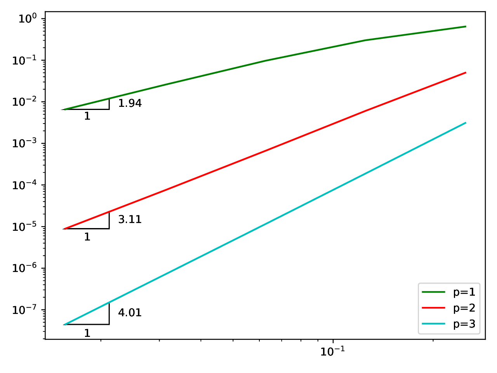
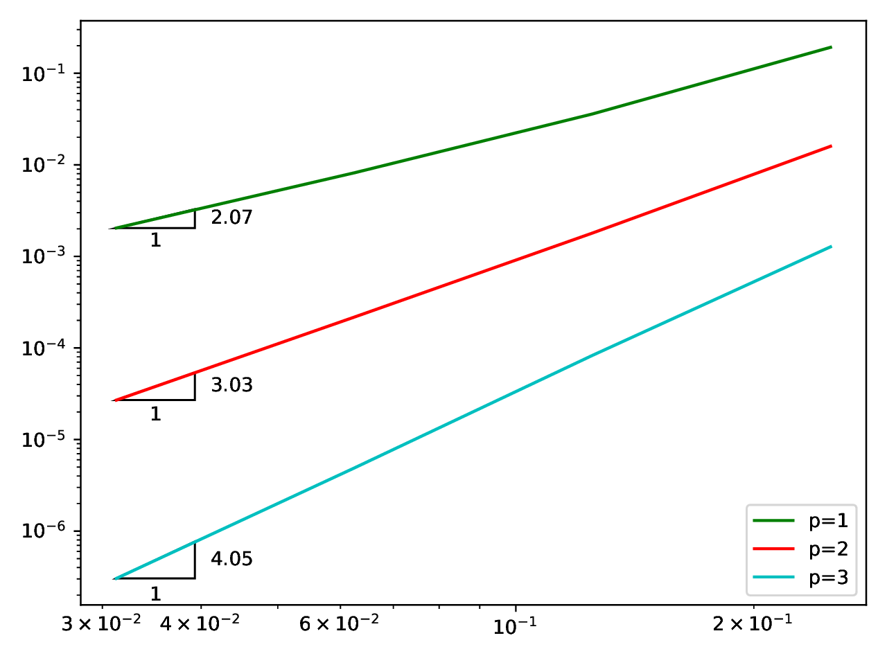
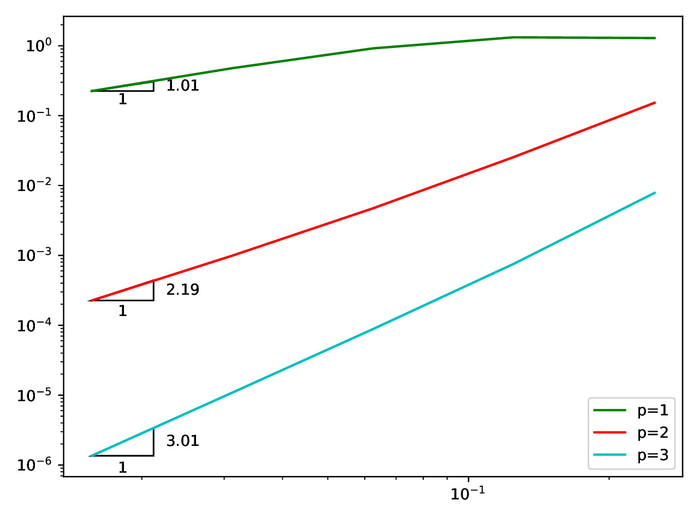

# UDG - Upwind Discontinuous Galerkin Method

A minimal python implementation of the upwind discontinuous galerkin method for solving scalar advection equations.

## Installation

### Prerequisites

- Python 3.11+
- uv (recommended) or pip

### Step 1: Install UV Package Manager

```bash
curl -LsSf https://astral.sh/uv/install.sh | sh
```

### Step 2: Install Dependencies

```bash
# Clone the repository
git clone https://github.com/jaisw7/udg.git

# Switch to the repository directory
cd udg

# Install project with development dependencies
uv sync --all-extras
```

### Step 3: Set Up Git Hooks (Optional but Recommended)

```bash
# Install pre-commit hooks
pre-commit install
```

### Step 4: Set Up virtual environment

```bash
source .venv/bin/activate
```

## Quick Start

### Step 1: Run the DGSEM solver (Kopriva et al., 2009)

```bash
python -m udg.cli sem-dg
```

### Step 2: Run the Nodal-DG solver (Hesthaven et al., 2008)

```bash
python -m udg.cli nodal-dg
```

### Step 3: Run the entropy-stable DG solver (Gassner et al., 2013)

```bash
python -m udg.cli entropy-dg
```

### Step 4: Run the upwind summation-by-parts DG solver

```bash
python -m udg.cli upwind-dg
```

## Development

### Code Quality

```bash
# Format code
make format

# Run linting
make lint

# Type checking
make type-check

# Run all checks
make pre-commit
```

## Contributing

Contributions are welcome! Please:

1. Fork the repository
2. Create a feature branch
3. Make your changes with tests
4. Run `make pre-commit` to ensure code quality
5. Submit a pull request

## License

MIT License - See LICENSE file for details

## Disclaimer

This software is for educational and research purposes only.

## Support

For issues, questions, or contributions:

- Open an issue on GitHub
- Check documentation
- Review test examples

## References

1. Kopriva, David A. Implementing spectral methods for partial differential equations: Algorithms for scientists and engineers. Springer Science & Business Media, 2009.
2. Hesthaven, Jan S., and Tim Warburton. Nodal Discontinuous Galerkin Methods: Algorithms, Analysis, and Applications. Springer Science & Business Media, 2008.
3. Gassner, Gregor J. "A skew-symmetric discontinuous Galerkin spectral element discretization and its relation to SBP-SAT finite difference methods." SIAM Journal on Scientific Computing 35.3 (2013): A1233-A1253.

## Results

### DGSEM



### Nodal-DG



### Entropy-Stable DG


### Upwind DG


